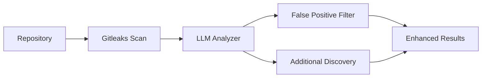

# SecretLens - LLM Enhanced Secret Detection Tool

[](https://opensource.org/licenses/MIT)
[](https://www.python.org/downloads/)

SecretLens is an LLM-enhanced secret detection tool that combines [Gitleaks](https://github.com/gitleaks/gitleaks) with AI analysis to dramatically reduce false positives and discover new types of secrets.

## 🎯 Why SecretLens?

Traditional secret scanning tools like Gitleaks suffer from:

- **High false positive rates** (~46% according to studies)
- **Limited context understanding** - can't distinguish test data from real secrets
- **Rule-based limitations** - miss new token formats and non-standard secrets

SecretLens solves these problems by adding **LLM semantic analysis** on top of Gitleaks' fast pattern matching.

## 🚀 Quick Start

### Prerequisites

1. **Python 3.8+**
2. **Gitleaks installed** (see installation guide below)
3. **LLM API key** (OpenAI or Anthropic)

### Installation

#### 🚀 One-Click Installation (Recommended)

**Linux/macOS:**

```bash
# Clone the repository
git clone https://github.com/yourusername/secretlens.git
cd secretlens

# Run the installation script
chmod +x install.sh && ./install.sh
```

**Windows (PowerShell):**

```powershell
# Clone the repository
git clone https://github.com/yourusername/secretlens.git
cd secretlens

# Run the installation script
Set-ExecutionPolicy RemoteSigned -Scope CurrentUser
.\install.ps1
```

The installation script will automatically:

- ✅ Check Python 3.8+ installation
- ✅ Install Gitleaks (via package manager or manual download)
- ✅ Install all Python dependencies
- ✅ Set up API keys interactively
- ✅ Test the installation
- ✅ Provide usage instructions

#### 📋 Manual Installation

If you prefer manual installation:

**1. Install Gitleaks**

**macOS:**

```bash
brew install gitleaks
```

**Linux:**

```bash
curl -sSfL https://raw.githubusercontent.com/gitleaks/gitleaks/master/scripts/install.sh | sh
```

**Windows:**

```powershell
winget install gitleaks
```

**2. Install SecretLens**

```bash
# Clone the repository
git clone https://github.com/yourusername/secretlens.git
cd secretlens

# Install dependencies
pip install -r requirements.txt
```

**3. Set up API Key**

**Option 1: Using .env file (Recommended)**

```bash
# Copy the example configuration
cp .env.example .env

# Edit .env file with your API key
# OPENAI_API_KEY=your-openai-api-key-here
# ANTHROPIC_API_KEY=your-anthropic-api-key-here
# LLM_MODEL=gpt-4o-mini  # Optional: specify model
# LLM_BASE_URL=https://your-proxy.com/v1  # Optional: for proxies
```

**Option 2: Environment variables**

```bash
# For OpenAI
export OPENAI_API_KEY="your-api-key-here"

# For Anthropic Claude
export ANTHROPIC_API_KEY="your-api-key-here"

# Optional: Custom base URL for proxies or compatible APIs
export LLM_BASE_URL="https://your-proxy.com/v1"
```

**Option 3: Command line arguments**

```bash
secretlens enhance . --api-key "your-key-here" --llm-base-url "https://your-proxy.com/v1"
```

### Basic Usage

```bash
# Quick scan of current directory
python -m secretlens enhance .

# Scan specific directory
python -m secretlens enhance /path/to/your/repository

# Analysis only (no LLM supplementary scan)
python -m secretlens enhance . --analysis-only

# Use different LLM provider
python -m secretlens enhance . --llm-provider anthropic --model claude-3-sonnet-20240229

# Set confidence threshold
python -m secretlens enhance . --confidence-threshold 0.8

# Save detailed report
python -m secretlens enhance . --output security-report.json
```

### Example Output

```
🔍 SecretLens Enhanced Scan Results
====================================

📊 Scan Summary:
  • Repository: /path/to/repo
  • Files scanned: 245
  • Initial Gitleaks matches: 12
  • False positives filtered: 8
  • High confidence secrets: 4
  • False positive rate: 33.3% → 8.3%

🚨 High Confidence Secrets Found:

1. API Key (Confidence: 0.95)
   File: config/production.py:15
   Type: openai-api-key
   Reasoning: Production configuration file with realistic API key format
   Action: Move to environment variable

2. Database Password (Confidence: 0.87)
   File: deploy/docker-compose.yml:23
   Type: password
   Reasoning: Docker compose with production database credentials
   Action: Use Docker secrets or env variables
```

## ✨ Key Features

### 🔍 **Smart False Positive Filtering**

- Analyzes code context to identify test data, examples, and templates
- Understands variable naming patterns and file purposes
- Filters out development/staging credentials clearly marked as such

### 🕵️ **Enhanced Secret Discovery**

- LLM independently analyzes code to find secrets missed by rules
- Identifies non-standard token formats (OAuth refresh tokens, custom APIs)
- Discovers credentials hidden in comments and documentation

### 📊 **Intelligent Reporting**

- Provides detailed reasoning for each detection
- Confidence scoring and risk assessment
- Actionable remediation suggestions

## 🏗️ How It Works



1. **Fast Screening**: Gitleaks performs rapid pattern-based detection
2. **Context Analysis**: LLM analyzes surrounding code for each potential secret
3. **Smart Filtering**: AI determines likelihood of false positives
4. **Discovery**: LLM finds additional secrets missed by traditional rules
5. **Reporting**: Provides detailed analysis with confidence scores

## 📈 Performance Comparison

| Feature                  | Traditional Gitleaks | SecretLens Enhanced        |
| ------------------------ | -------------------- | -------------------------- |
| Detection Speed          | Fast                 | Medium (LLM analysis time) |
| False Positive Rate      | ~46%                 | Expected <10%              |
| False Negative Discovery | Rule-dependent       | LLM semantic analysis      |
| Context Understanding    | None                 | Strong                     |
| New Secret ID            | Lagging              | Real-time adaptation       |
| Explanation Ability      | Basic                | Detailed analysis          |

## 🛠️ Integration Examples

### Pre-commit Hook

```yaml
repos:
  - repo: local
    hooks:
      - id: secretlens
        name: SecretLens Secret Detection
        entry: python -m secretlens enhance
        language: python
        args: ["--analysis-only", "--confidence-threshold", "0.7"]
        pass_filenames: false
```

### GitHub Actions

```yaml
name: Security Scan
on: [push, pull_request]

jobs:
  secret-scan:
    runs-on: ubuntu-latest
    steps:
      - uses: actions/checkout@v3

      - name: Install Gitleaks
        run: |
          curl -sSfL https://raw.githubusercontent.com/gitleaks/gitleaks/master/scripts/install.sh | sh
          sudo mv gitleaks /usr/local/bin/

      - name: Setup Python
        uses: actions/setup-python@v4
        with:
          python-version: "3.9"

      - name: Install SecretLens
        run: pip install -r requirements.txt

      - name: Run SecretLens
        env:
          OPENAI_API_KEY: ${{ secrets.OPENAI_API_KEY }}
        run: python -m secretlens enhance . --output security-report.json
```

## 📚 Documentation

- **[technical-guide.md](technical-guide.md)** - Complete technical documentation, advanced features, and configuration
- **[examples/](examples/)** - Sample repositories and test cases

## 🤝 Contributing

We welcome contributions! Please see our contributing guidelines and code of conduct.

## 📄 License

This project is licensed under the MIT License - see the [LICENSE](LICENSE) file for details.

## 🙏 Acknowledgments

- [Gitleaks](https://github.com/gitleaks/gitleaks) for the foundational secret detection engine
- OpenAI and Anthropic for LLM APIs that power the semantic analysis
